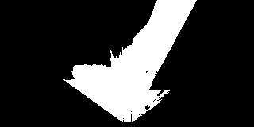
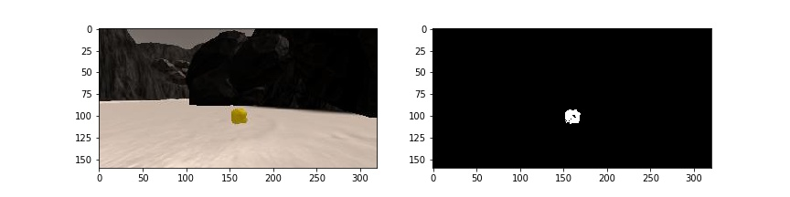
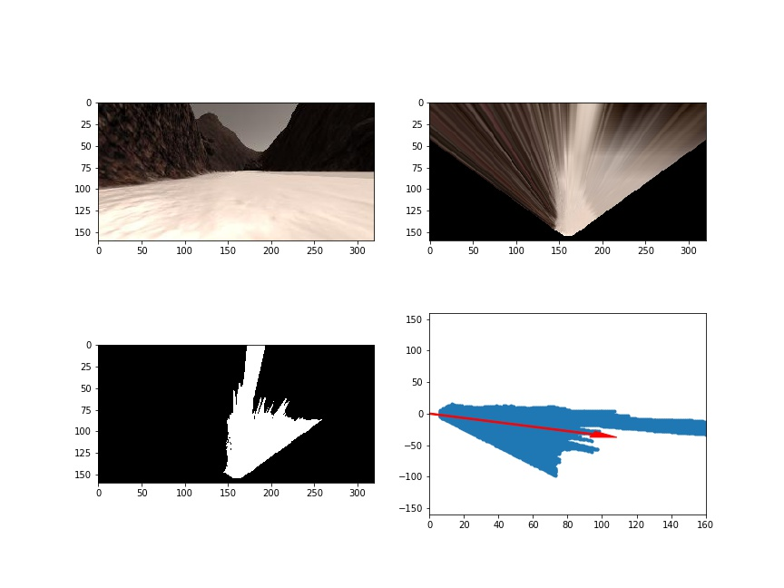
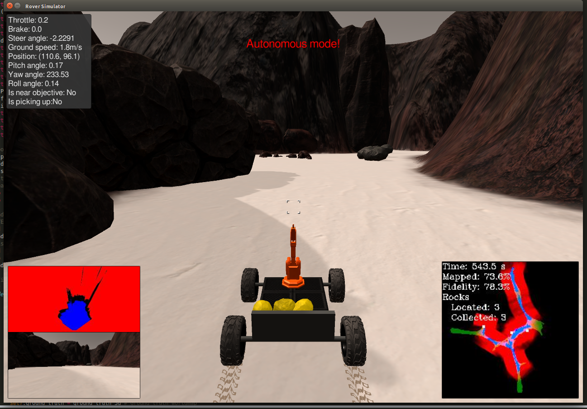

# Mars Rover Project: Search and Sample Return NASA Chalenge

This search and sample return project was based after the [NASA sample return challenge](https://www.nasa.gov/directorates/spacetech/centennial_challenges/sample_return_robot/index.html), and it provides experience with the three essential elements of robotics, which are perception, decision making and actuation. This specific project uses the Unity game engine to simulate the environment.

## The Simulator
The simulator can be downloaded here:
* [Linux](https://s3-us-west-1.amazonaws.com/udacity-robotics/Rover+Unity+Sims/Linux_Roversim.zip)
* [Mac](https://s3-us-west-1.amazonaws.com/udacity-robotics/Rover+Unity+Sims/Mac_Roversim.zip)
* [Windows](https://s3-us-west-1.amazonaws.com/udacity-robotics/Rover+Unity+Sims/Windows_Roversim.zip)

## Dependencies
The included code requires Python 3 and many dependencies. Using Anaconda is the easiest way to get things working. View the instructions at the [RoboND Python Starterkit](https://github.com/ryan-keenan/RoboND-Python-Starterkit/blob/master/doc/configure_via_anaconda.md).

## Run the Code
You can test out the simulator by opening it up and choosing "Training Mode."

To run the automated code included in this repository:
* Activate the conda environment with `source activate RoboND` (setup by following the instructions [here](https://github.com/ryan-keenan/RoboND-Python-Starterkit/blob/master/doc/configure_via_anaconda.md))
* Run `python ./code/drive_rover.py` to start the automation logic (this communicates with the simulator directly)
* Start the simulator (double click `Roversim.x86_64` or `Roversim.x86`) and choose "Autonomous Mode."

## Notebook Analysis
This [Jupyter Notebook](./code/Rover_Project_Test_Notebook.ipynb) includes all of the major functions, which are broken out into individual sections as follows:

### Color Thresholding for the navigalbe terrain, the obstacles and sample rocks
To detect navigable areas, I used the default color threshold of > rgb(160, 160, 160), which worked well in tests. Obstacles are calculated by taking the opposite of the navigable area and applying the mask of the warped image to only include negated parts in the field of view.
For sample detection, I created a new function that could find pixels in between two RGB values so that I could detect the specific color of the sample rockes. These sample rocks are yellow. I used a HSV filter range of [20, 150, 100] and [50, 255, 255] to pull out yello-ish objects. Any time a sample rock is seen in the rover's camera, a mask with values will be returned. This mask is used to guide the rover over to the sample rock. THe following pictures are the examples for the navigable color threshold (top) and sample color and color threshold used in this project (bottom).

 

### Image processing
Populate the process_image() function with the appropriate analysis steps to map pixels identifying navigable terrain, obstacles and rock samples into a worldmap. Run process_image() on your test data using the moviepy functions provided to create video output of your result.
The `process_image` function contains all the functionality for taking a raw image and determining where the rover is able to navigate and if a sample rock is nearby. This function also populates the world map with features identified as the rover moves around.

#### Perspective Transformation, Color threshold and Rover-centric Coordinates
The first step in the pipeline is to change the image from the rover's vantage point to a top down view. This is done with a perspective transformation that takes a predetermined trapezoidal shape and converts it into a square shape. I used OpenCV's `getPerspectiveTransform` and `warpPerspective` functions to perform this transformation.
This transformed image is then run through the three color threshold functions I discussed above. This will identify the navigable area, the obstacles and any sample rocks in the frame.
An important next step is to change the image arrays to be relative to the front of the rover. This is done by flipping the image so it's centered along the x-axis of the rover's grid.
The image below shows the above steps to go from the rover's camera to the rover-centric navigable image.

#### World Coordinates and make a video from processed image data
In order to fill out the world map, the image's rover-centric coordinates must be transformed into world coordinates. By performing a perspective transformation and color threshold, it is possible to calculate a suitable path the rover can use to drive forward. Here is a video of the rover navigating through the simulation while populating the world map.

## Autonomous Navigation and Mapping
The Python files within this repository hook into the simulation and allow the rover to be fully autonomous in its goal of mapping the environment and collecting all the sample rocks before returning back to the starting position. The two main functions are `perception_step` in `perception.py` and `decision_step` in `decision.py`. I will discuss each of these functions below:

### Perception
The `perception.py` file includes all of the code used to identify where the rover is and what is around it. It is predominately based on image processing of the rover's camera feed.

The `perception_step` function is similar to the `process_image` function mentioned above, however, `perception_step` includes a restriction on what values are added to the world map. This is done to improve the fidelity of the data captured. I restrict the data based on the pitch and roll of the rover, where each can only be 0.5 degrees off the axis. Through normal driving, the rover can experience changes of +/- 2 degrees off the axis. This restriction does limit the amount of area mapped, but the improvement in fidelity is worth the trade off.

Another difference is that the `perception_step` function is the inclusion of the navigable area polar coordinate calculation. This process changes the rover-centric pixel positions to polar coordinates (based on distances and angles from the root). The polar coordinates are needed by the rover because this allows it to find a suitable path for driving around.

Finally, the `perception_step` function includes code for identifying if a sample rock is seen from the image. This information is also converted into polar coordinates that the rover uses to determine how best to approach the sample rock.

### Decision
The `decision.py` file includes all of the code used by the rover for decision making. It takes the sensor data from `perception.py` and tries to determine what actions it should make.

The main areas within the file are the forward, stop and stuck sections.

#### Forward, stop and stuck
The forward section includes logic for calculating where the rover should drive forward. I used the average angle of the potential navigable area. 
The forward section also contains the logic for approaching sample rocks. The `perception_step` function flags that a sample has been seen. This tells the rover a sample rock is nearby, and that it should:
* Navigate directly to the sample rock (if it's within +/- 15 degrees of the rover's x-axis)
* Rotate sharply near the sample rock for a better approach angle (if it's more than 15 degrees and less than 50 degrees off the rover's x-axis)
* Continue it's search since it lost the sample rock or it took too long trying to approach the sample rock

Once the rover is close to the sample rock, it will stop, the arm will pick up the rock, and it will continue it's search for more samples.

The stop section is important for making the rover rotate to a new direction. This often occurs when the rover is up against an obstacle, where the only navigable option is to turn around. Once the rover has a clear path ahead of it, it changes back to the forward mode.

I included multiple sections for identifying and reacting to a stuck rover. The three sections include:
* Stuck on an obstacle (rover given throttle but velocity remains 0)
* Caught in a circle (rover continually steers in a circle)
* Trying to approach a sample rock for too long (maybe mistakenly saw a sample rock)

Each of these sections uses a combination of either changing the velocity or direction of the rover, or switching a rover flag.

### Performance and Future Improvement 
I ran the simulator at a resolution of 1280x864 with good graphics quality. The code I built has good performance mapping and navigating the simulation. It most runs, it is able to map about 80% of the area while maintaining a fidelity of around 70%. It is able to map almost all of the terrain with relatively high fidelity and can detect and pick up three to five of the samples in the map depending on where the rocks are located. The rover is able to move quite fast. If a rock is in a side nook, the rover will have trouble finding it.
Due to simulator issues with the camera occasionally seeing through obstacles, the rover sometimes gets stuck, thinking that it can move forward even if it is against a rock. In the future, this can be fixed by detecting when the position has not changed for some time. Another part to improve would be the wall following, which sometimes fails to detect side corners especially if the rover is moving fast. Furthermore, calculating the navigatable threshold terrain would be modified by involving other angular parameters i.e. pitch and roll. That could be a big help with getting better navigatable terrain when the rover with a relatively high speed in slops or a sharp brakes.  

